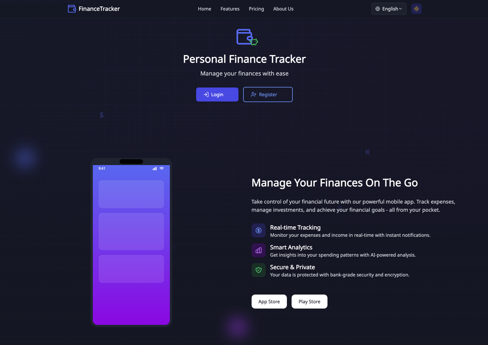
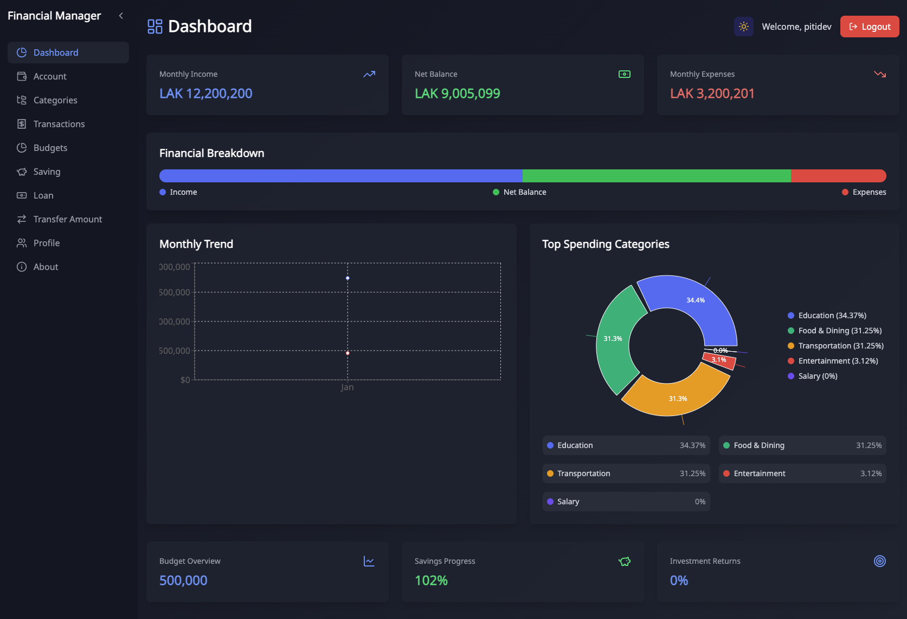
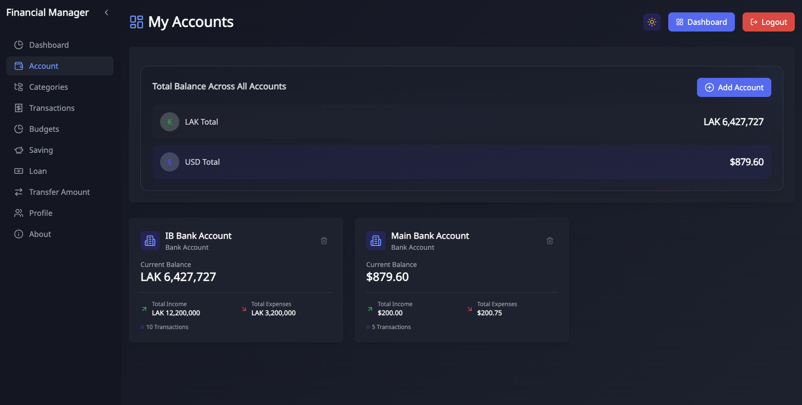

# Personal Finance Tracker 💰📊

## Overview
Personal Finance Tracker is a modern, full-stack web application built with Next.js that helps users manage their finances, track expenses, set budgets, and gain insights into their financial health.

## 🌟 Features

### Dashboard
- Real-time financial overview
- Income and expense tracking
- Spending category analysis
- Monthly financial trends
- Investment tracking
- Savings goal monitoring

### Key Technologies
- Next.js 15
- React 19
- TypeScript
- Tailwind CSS
- Zustand (State Management)
- Recharts (Data Visualization)
- NextAuth (Authentication)
- Prisma (Database ORM)

## 🖼️ Screenshots

### Landing Page


### Dashboard


### Dark Mode


## 🚀 Getting Started

### Prerequisites
- Node.js (v18.17+ recommended)
- npm or yarn
- PostgreSQL database

### Installation Steps

1. Clone the repository
```bash
git clone https://github.com/PitiDev/Personal-Finance-Tracker.git
cd personal-finance-tracker
```

2. Install dependencies
```bash
npm install
# or
yarn install
```

3. Set up environment variables
Create a `.env` file in the root directory and add:
```
DATABASE_URL="your_postgresql_connection_string"
NEXTAUTH_SECRET="your_nextauth_secret"
```

4. Run database migrations
```bash
npx prisma migrate dev
```

5. Start the development server
```bash
npm run dev
# or
yarn dev
```

Open [http://localhost:3000](http://localhost:3000) in your browser
Production Demo [https://sabaimoney.com/](https://sabaimoney.com/) in your browser

## 🔐 Authentication

The app supports multiple authentication methods:
- Email/Password login
- Social login (Google, GitHub) - coming soon

## 🌐 Internationalization

Supports multiple languages:
- English
- Lao
- Thai
- Japanese

## 📱 Responsive Design

Fully responsive design works seamlessly on:
- Desktop
- Tablet
- Mobile devices

## 🛠️ Customization

### Theme
- Light Mode
- Dark Mode
- Custom color themes via Tailwind CSS

### Language
Switch languages easily using the language selector

## 🔧 Configuration

- `next.config.ts`: Next.js configuration
- `tailwind.config.ts`: Tailwind CSS customization
- `tsconfig.json`: TypeScript configuration

## 📦 Dependencies

Key dependencies:
- Next.js
- React
- Tailwind CSS
- Zustand
- Recharts
- Axios
- Prisma

## 🧪 Testing

### Running Tests
```bash
npm run test
# or
yarn test
```

## 🚢 Deployment

Easily deployable on:
- Vercel
- Netlify
- Heroku
- DigitalOcean

## 📝 TODO
- [ ] Add more investment tracking features
- [ ] Implement budget alerts
- [ ] Create advanced reporting
- [ ] Add more payment method integrations

## 🤝 Contributing

1. Fork the repository
2. Create your feature branch (`git checkout -b feature/AmazingFeature`)
3. Commit your changes (`git commit -m 'Add some AmazingFeature'`)
4. Push to the branch (`git push origin feature/AmazingFeature`)
5. Open a Pull Request

## 📄 License

Distributed under the MIT License. See `LICENSE` for more information.

## 📧 Contact

Your Name - [pitidev.lao@gmail.com](mailto:pitidev.lao@gmail.com)

Project Link: [https://github.com/PitiDev/Personal-Finance-Tracker](https://github.com/PitiDev/Personal-Finance-Tracker)

---

**Built with ❤️ by Xtech Solutions** (Piti Phanthasombath)

🍺 Support me by buying me a beer
[Buy me a beer](https://buymeacoffee.com/pitidev)
